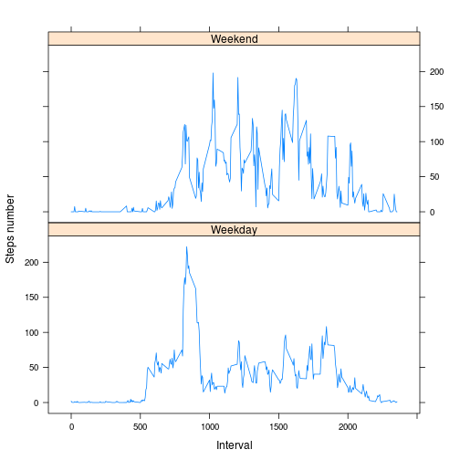

# Reproducible Research: Peer Assessment 1
### Author: Omar Velazquez
## Introduction
This document has been created to fulfill the first Peer Assessment Prject for training course "Reproducible research" from Data Science Specialization conducted by Roger D. Peng, PhD, Jeff Leek, PhD, Brian Caffo, PhD from John Hopkins University.
The main goals are:
* Write a report that answers the questions detailed into peer assessment 1.
* Create a single R markdown document that can be processed by knitr and be transformed into an HTML file.
* Include the code used by present report.

The original source code has been forked from <http://github.com/rdpeng/RepData_PeerAssessment1>, and results has are under the link: <https://github.com/chaneke/RepData_PeerAssessment1/blob/master/PA1_template.Rmd> in my GITHub Repo


## Loading and preprocessing the data

In order to perform load and process the data for this assignement, a special directory has been created into the root directory for the project, this is called ***./scripts/***:

This path is stored into scriptsDir object.

The directory contains:

```r
dir("scripts/")
```

[1] "averageDailyActivityPattern.R"      
[2] "differenceBetweenWeekdaysWeekends.R"
[3] "initialize.R"                       
[4] "inputMissingValues.R"               
[5] "totalStepsByDay.R"                  
As you can read, each one of the questions/topics covered by this assignement had one R script stored into the scripts directory.

One of those scripts is called ***initialize.R***, located in  *./scripts/* and is used to:
- Initialize libraries used by the project
- Set working directory
- Find ZIP file "activity.zip", and if is not located then download is started from the URL <https://d396qusza40orc.cloudfront.net/repdata%2Fdata%2Factivity.zip>
- Find CSV file data source, if is not located then proceed to unzip the previously downloaded file "activity.zip"
- If the dataSet object is still not created, then proceed to read csv data set, and its data is stored into dataSetObject, used trough whole project


## What is mean total number of steps taken per day?

```r
totalStepsByDay<-aggregate(steps~date,data=dataSet,sum)
hist(totalStepsByDay$steps,main="Steps by day",col="blue",border="cyan",xlab="",ylab="",axes=TRUE)
```

 

```r
totalStepsMean<-mean(totalStepsByDay$steps)
totalStepsMedian<-median(totalStepsByDay$steps)
```

**Total steps MEAN:**

```
## 10766
```
**Total steps MEDIAN:**

```
## 10765
```

**source code in:** *./scripts/totalStepsByDay.R*


## What is the average daily activity pattern?

```r
fiveMinutesIntervals<-tapply(dataSet$steps, dataSet$interval, mean, na.rm = TRUE)
plot(row.names(fiveMinutesIntervals),fiveMinutesIntervals, type = "l", 
     xlab = "5 minutes interval",ylab = "Steps count", main = "Average number of steps",col = "blue")
```

 

```r
maximumInterval<-which.max(fiveMinutesIntervals)
```

**MAX Interval:**

[1] "835"

**source code in:** *./scripts/totalStepsByDay.R*


## Imputing missing values

```r
stepsAverage<-aggregate(steps ~ interval, data = dataSet, FUN = mean)
replaceNas<-numeric()
for (i in 1:nrow(dataSet)) {
    position<-dataSet[i, ]
    if (is.na(position$steps)) {
        steps<-subset(stepsAverage,interval==position$interval)$steps
    } else {
        steps<-position$steps
    }
    replaceNas<-c(replaceNas, steps)
}
dataSet2<-dataSet
dataSet2$steps<-replaceNas
totalStepsWithNas<-aggregate(steps ~ date, data = dataSet2, sum, na.rm = TRUE)
hist(totalStepsWithNas$steps, main = "Steps by day with NAs replaced by steps Average", 
     xlab = "",ylab="", col = "violet")
```

 

```r
totalSteps2Mean<-mean(totalStepsWithNas$steps)
totalSteps2Median<-median(totalStepsWithNas$steps)
```

**Total steps [NAS replaced by steps average] MEAN:**

```
## 10766.1886792453
```

**Total steps [NAS replaced by steps average] MEDIAN:**

```
## 10765
```

**source code in:** *./scripts/inputMissingValues.R*


## Are there differences in activity patterns between weekdays and weekends?

```r
dataSet$date<-as.Date(dataSet$date, "%Y-%m-%d")
weekDays<-weekdays(dataSet$date)
dayKind <- vector()
for(i in 1:nrow(dataSet)){
    dayKind[i]<-"Weekday"
    if((tolower(weekDays[i]) == "saturday" || tolower(weekDays[i]) == "sunday" ) ||
       (tolower(weekDays[i]) == "sabado" || tolower(weekDays[i]) == "domingo" )    
    ){
        dayKind[i]<-"Weekend"
    }
}
dataSet$dayKind<-dayKind
dataSet$dayKind<-factor(dataSet$dayKind)
dailyStepsCount<-aggregate(steps ~ interval + dayKind, data = dataSet, mean)
names(dailyStepsCount)<-c("interval", "dayKind", "steps")
weekdayWeekendPlot<-xyplot(steps ~ interval | dayKind, dailyStepsCount, type = "l", layout = c(1, 2), 
           xlab = "Interval", ylab = "Steps number")
print(weekdayWeekendPlot)
```

 

**The main difference is that in Weekends the number of steps keeps between 100 and 160, and in Weekdays we can see picks, but the value more often seen is around 50 and 100 steps**

**source code in:** *./scripts/differenceBetweenWeekdaysWeekends.R*
